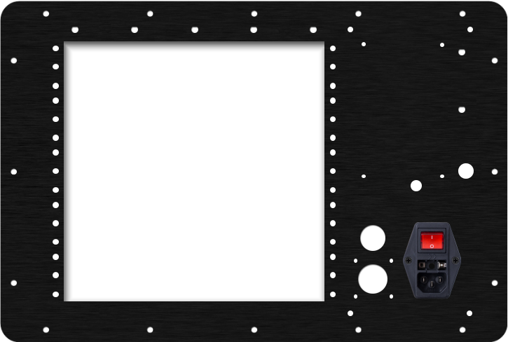
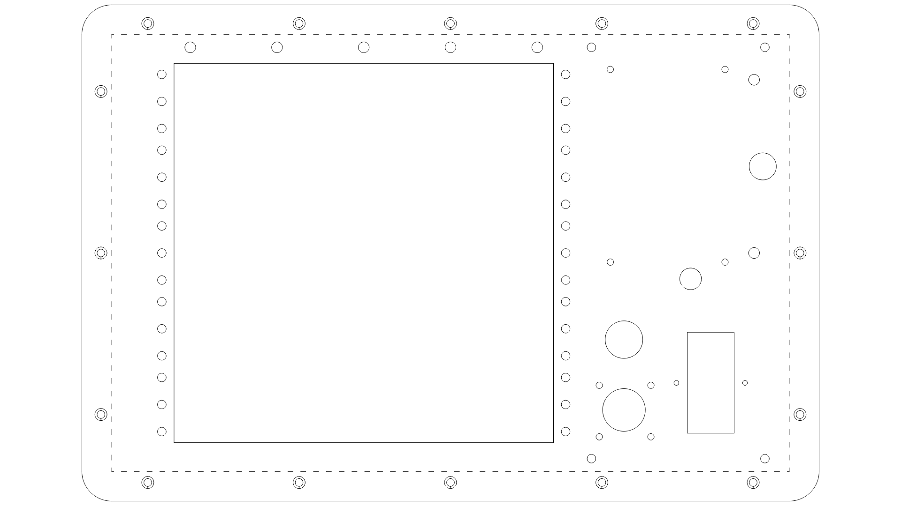

# cyberdeck
A custom build of Kali Linux Raspberry Pi’s, fun little radios, all packaged in a portable Pelican case.

### Bill of Materials

A complete bill of materials can be found [here](https://github.com/jagould2012/cyberdeck/blob/main/bom.csv).

### Custom Plate

The custom plate was manufactured by DataPro using their online [designer](https://www.datapro.net/cgi-bin/plate-designer-pro). All hole and part coordinates can be found [here](https://github.com/jagould2012/cyberdeck/blob/main/plate_drill.csv).

Dxf file is available [here](https://github.com/jagould2012/cyberdeck/blob/main/dxf/Panel.dxf).

### Power

Wiring diagram for the power supplies, switches, and relays can be found [here](https://github.com/jagould2012/cyberdeck/blob/main/images/power.png).

### Internal Panels

Power supplies and USB devices are mounted to 1/8" ABS panels. Dxf files for the panels can be found [here](https://github.com/jagould2012/cyberdeck/blob/main/dxf/).