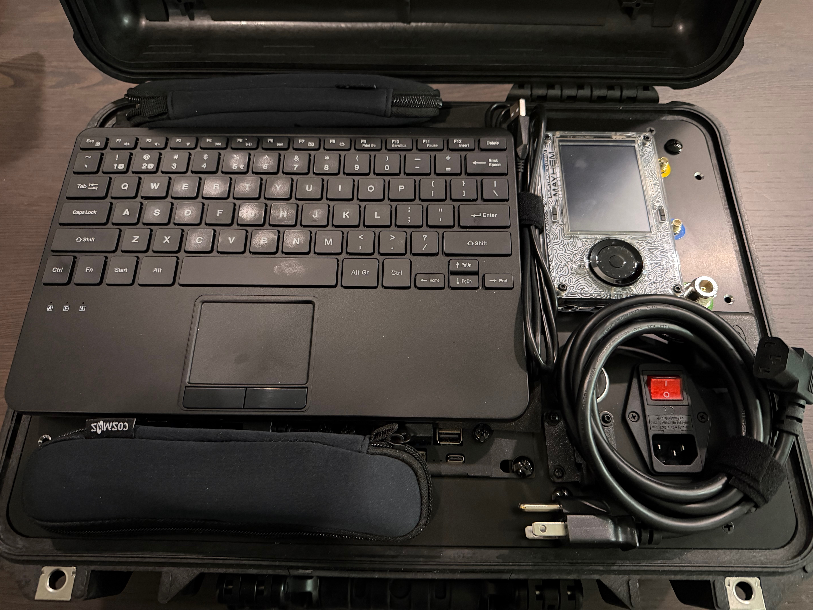

# Assembly and Power Up

	
Under Construction - Check back soon

	TODO - add sub-system assembly photos

5. Before powering up, check all power circuits for shorts. A USB power meter is recommended for checking all the 5vdc USB plugs for constant and stable power before plugging them into sensitive equipment.

6. Before installing all 16 bezel screws, we recommend a full system test. Connect your antennas and verify signal to each radio, plug in USB keyboard and external monitor, check both power sources, and verify the Ethernet and WiFi is working.

7. Two sheets of neoprene foam are placed below the keyboard to protect the screens in transit. Antennas are stored in small neoprene pouches and cables secured with velcro strips.

