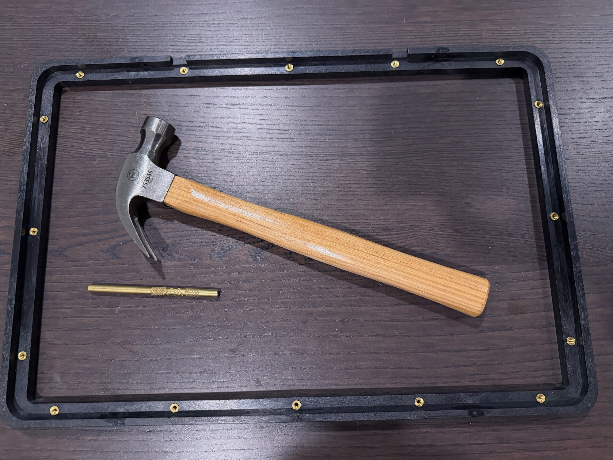
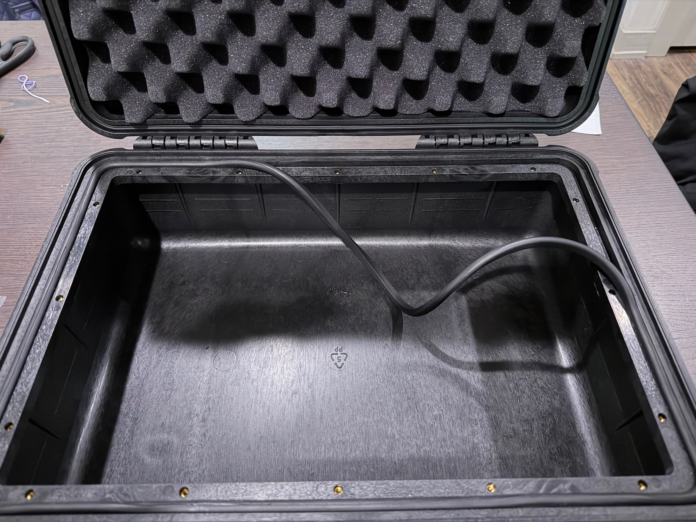
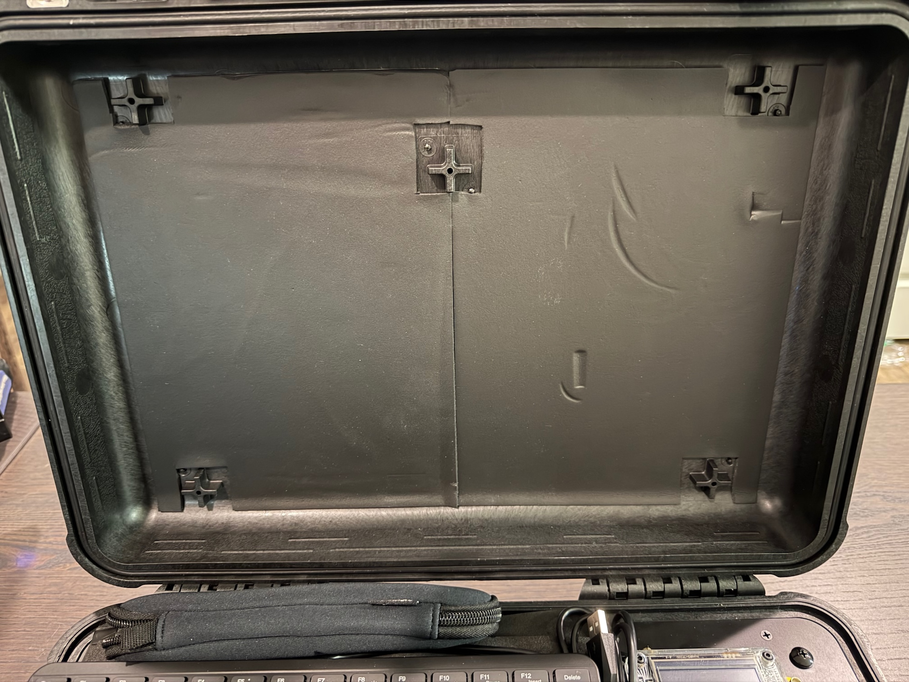

# Pelican Case

1. Drive the threaded inserts into the frame. While the Pelican instructions say to use the tip of a screwdriver, we found a brass drift is a much better tool.

2. Using a cordless drill, drive the four supplied screws into the case. You will notice that the pre-drilled holes in the frame align with the thick ribs of the case, where the screws will not penetrate the outside of the case.

3. Insert the gasket into the frame. There is plenty of gasket, so don't stretch it as you work around the frame.

4. Remove the foam from the lid and line it with two adhesive neoprene sheets. You will need to cut around the screw mounts in the lid. We found it easiest to measure cuts on one sheet, then lay the second piece face to face with the first, mirroring the cuts.

