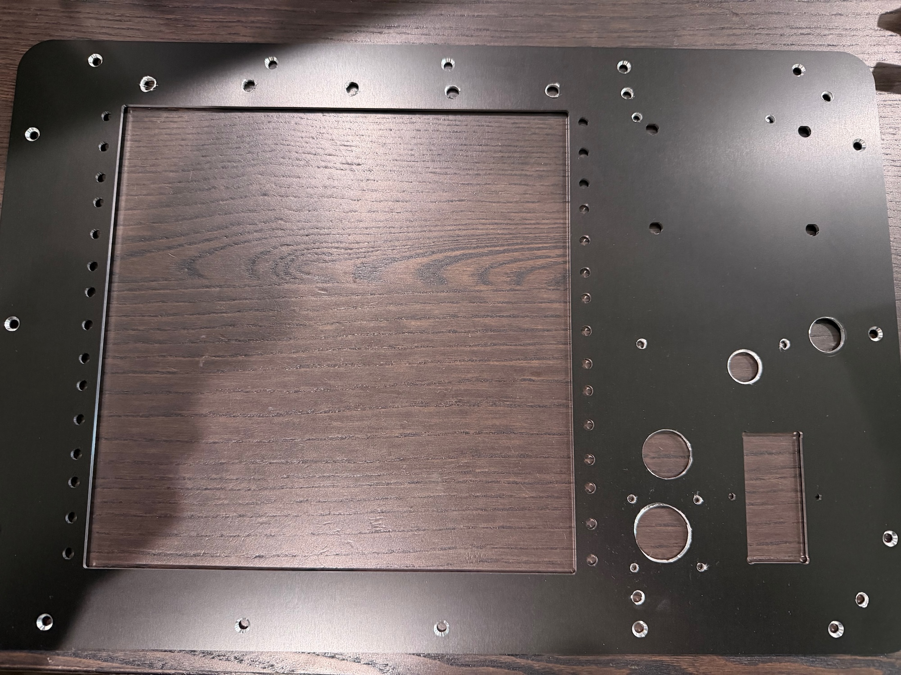
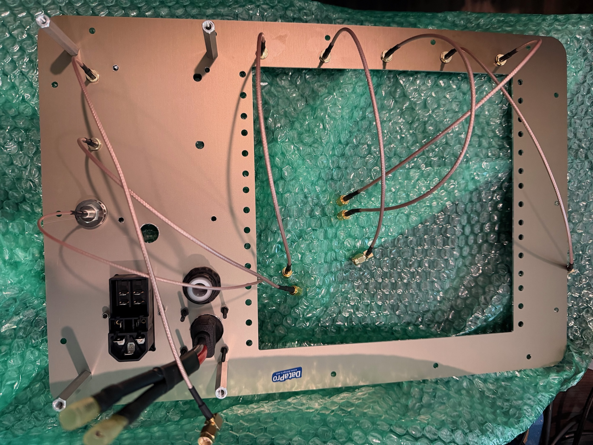
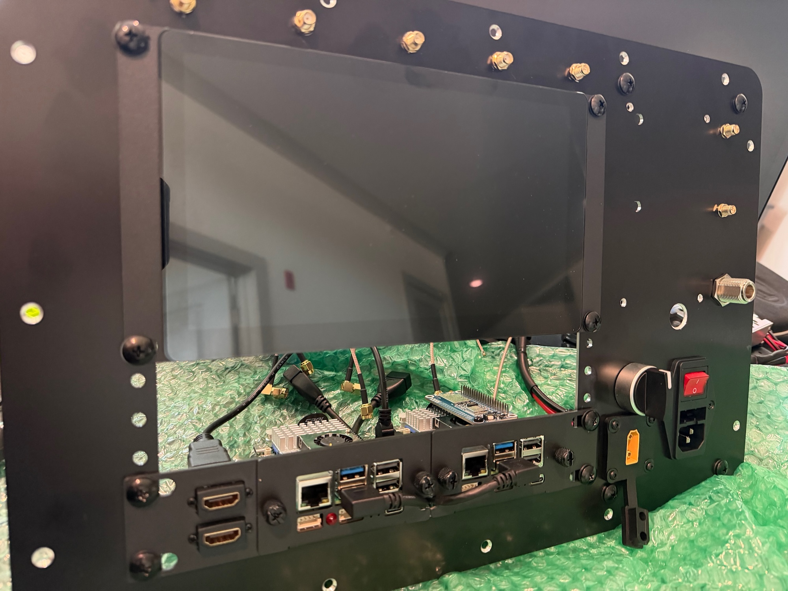
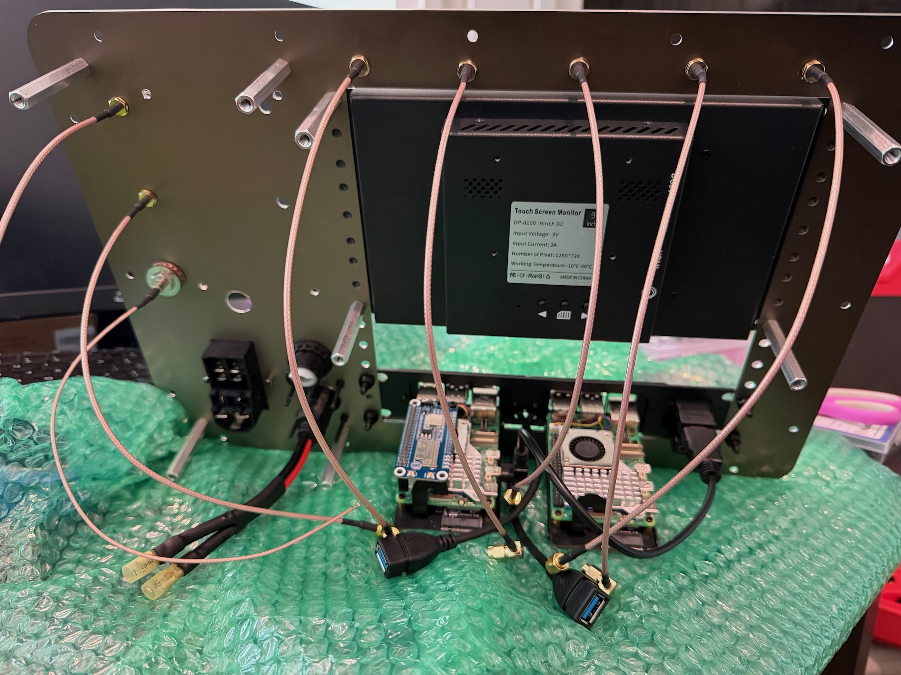
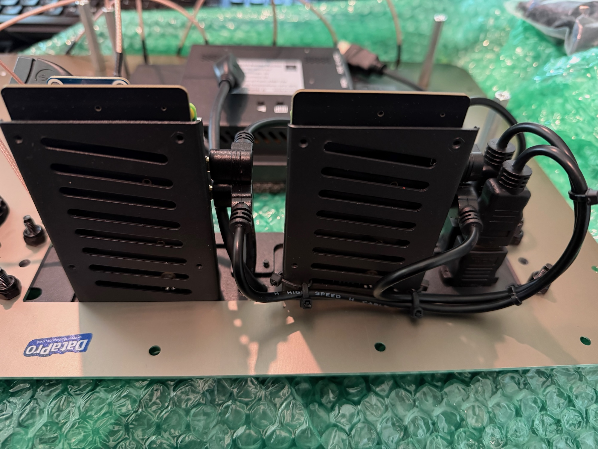
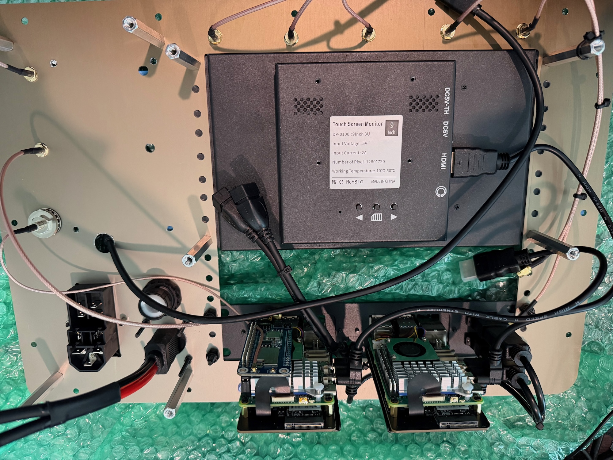
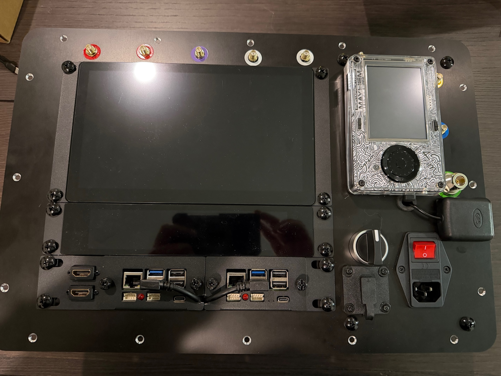

# Front Plate

1. Prep the front panel. We had to add some holes post manufacturing, due to design changes, but if you follow the included [drawings](https://github.com/jagould2012/cyberdeck/blob/main/dxf/Panel.dxf) and drill [positions](https://github.com/jagould2012/cyberdeck/blob/main/plate_drill.csv), your plate will arrive from DataPro compeletely ready.

2. Begin to populate the panel - add standoffs, install power switch and inlets, and add RF cables.

3. Install the screens and Raspberry Pi shelf using either standoffs where specified, or lock nuts.

4. Prepare all the cables for the installation of the sub-assemblies.

Note: N-connector shown in this picture was later replaced with right angle connector due to clearance issues. See bill of materials.

5. Wire the HDMI cables up to the Raspberry Pi and secure them with small cable ties. HDMI 0 goes to the LCD touchscreens and HDMI 1 goes to the plate mounted HDMI pass through.

6. Plug in HDMI and USB cables to the touchscreens before installing other panels.

Note: N-connector shown in this picture was later replaced with right angle connector due to clearance issues. See bill of materials.

7. While working on the panel, we recommend installing a piece of foam over touchscreens to prevent them from being scratched.

Note: Right angle USB connector shown in this picture was later upgraded to more compact flex cable, shown in picture below. See bill of materials.

8. Install the Mayham Portapak, right angle slim USB cable, and GPS antenna. Color ring stickers were cut on a vinyl cutter to color code the antenna connectors and a corresponding color strip was wrapped around the antenna.

