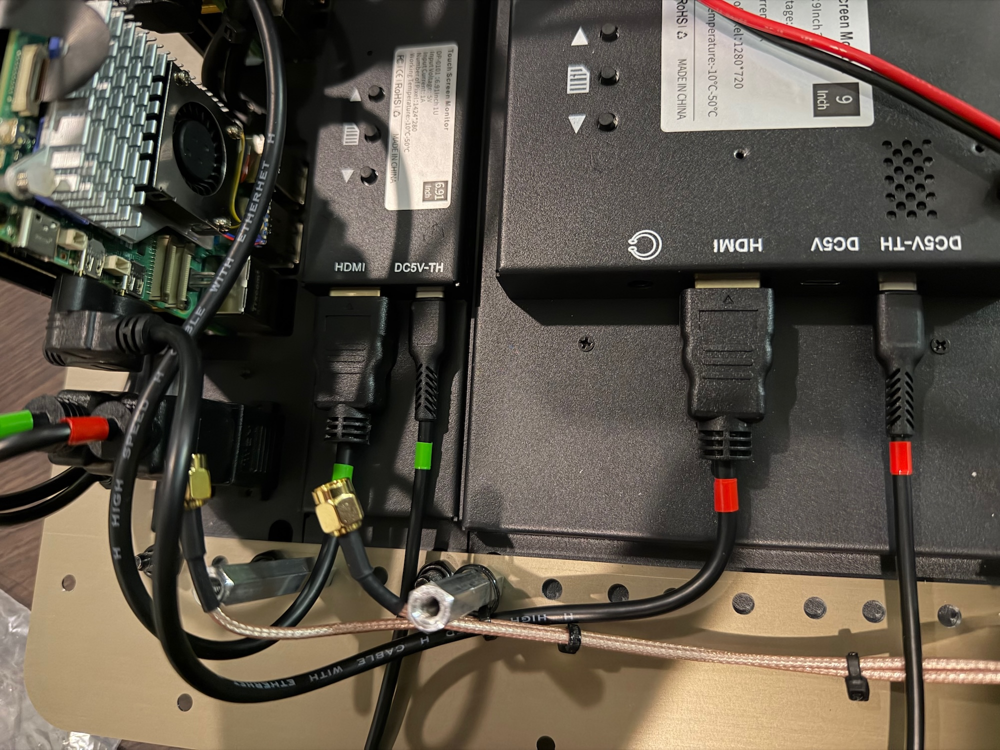

# USB Panel

1. Terminal strips are attached to the back of the USB panel to distribute 5vdc power from the two power supplies. Each strip powers a Raspberry Pi, an LCD touchscreen, and one USB hub.

2. We used a vinyl cutter to cut letters A and B to designate the two redundant halfs of the compute section. Vinyl strips 1/4" x 1.5" where cut to mark each end of all USB, HDMI, and power cables. This assists in debugging as you dont have to trace wires back to the Pi boards to know which section it belongs to.

	
Under Construction - Check back soon

	TODO - add new USB hub photos

